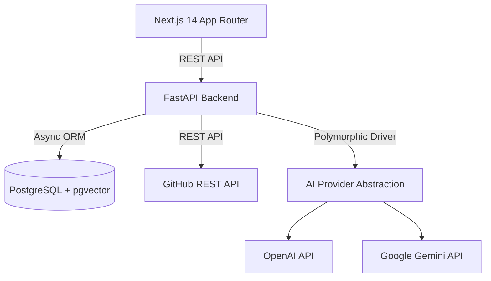

# RepoPilot AI 🚀

> **AI-Powered GitHub Repository Intelligence & Open-Source Contribution Assistant**

RepoPilot AI is a complete, full-stack, production-grade application designed to help developers explore, understand, analyze, secure, and contribute to open-source GitHub repositories.

---

## 🌟 Key Features

1. **Repository Ingestion & Metadata Analysis**: Enter any public GitHub repository URL to parse stargazers, forks, default branch, topics, and language breakdown.
2. **File Explorer & Safe Content Viewer**: Inspect repository trees and file contents safely with built-in path-traversal boundaries.
3. **Repository RAG Chat Assistant**: Interactive AI chat with codebase semantic retrieval, context window management, and source line-range citations.
4. **Beginner GitHub Issue Finder**: Syncs live GitHub issues, categorizes difficulty (`beginner`, `intermediate`, `advanced`), suggests relevant source files, and outlines implementation steps.
5. **Contribution Workspace & AI Code Review**: Evaluates proposed `git diff` changes for correctness, security vulnerabilities, breaking changes, and performance, returning line-by-line fix suggestions.
6. **Pull Request Description Generator**: Automatically generates professional PR titles and Markdown descriptions with checklists and issue references.
7. **Static Security & Code-Quality Scanner**: Deterministic vulnerability detection (Semgrep & Bandit rule sets) inspecting secrets, command injections, SQL vectors, and vulnerable dependencies (OSV-Scanner), enriched with AI remediation advice.
8. **System Architecture Map**: Dynamic visual topology graph outlining microservices, database schemas, AI abstractions, and module dependencies.
9. **Technical Documentation Generator**: Automatically synthesizes complete GitHub-ready documentation suites (`architecture.md`, `api.md`, `database.md`, `development.md`).

---

## 🏗️ Monorepo Architecture



---

## 🚀 Quickstart Guide

### Prerequisites
- Python 3.11+
- Node.js 18+ and `npm`
- PostgreSQL with `pgvector` extension (or Docker)

### 1. Clone & Configure
```bash
git clone https://github.com/your-username/RepoPilot-AI.git
cd RepoPilot-AI
cp .env.example .env
```

### 2. Run with Docker Compose (Recommended)
```bash
docker-compose up --build
```
Access the application at:
- **Frontend Dashboard**: `http://localhost:3000`
- **FastAPI Backend**: `http://localhost:8000`
- **Interactive Swagger Docs**: `http://localhost:8000/docs`

### 3. Run Locally (Manual Setup)

#### Backend Setup
```bash
cd backend
python -m venv venv
# On Windows:
.\venv\Scripts\activate
# On Unix:
source venv/bin/activate

pip install -r requirements.txt
python -m pytest # Run backend test suite (29 tests)
uvicorn app.main:app --reload --port 8000
```

#### Frontend Setup
```bash
cd frontend
npm install
npm run build # Verify production build
npm run dev
```

---

## 🧪 Testing & Quality Assurance

- **Backend Pytest Suite**: 29 unit and integration tests passing (`pytest`).
- **Frontend Type Safety**: Next.js 14 App Router compiled cleanly (`npx next build`).

---

## 📜 License

Distributed under the MIT License. See [`LICENSE`](LICENSE) for details.
