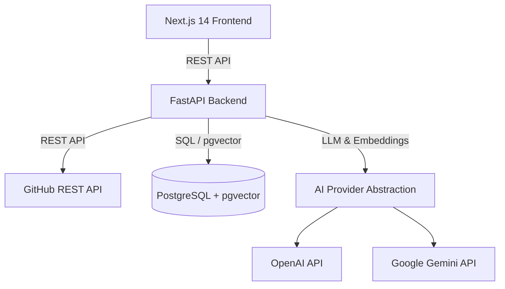

# RepoPilot AI - System Architecture

RepoPilot AI is designed as a modern monorepo separating frontend UI components, backend analysis microservice APIs, and vector database storage.

## Core Components

1. **Frontend (Next.js 14 App Router)**:
   - Next.js TypeScript layout and interactive state management.
   - Monaco Editor for code review diff visualization.
   - React Flow for dynamic architecture dependency graphs.

2. **Backend Service (FastAPI)**:
   - Async API endpoints handling repository ingestion and retrieval.
   - GitHub REST API wrapper service for fetching repository metadata and file trees.
   - Static security & code quality analyzer integrations.

3. **Database Layer (PostgreSQL + pgvector)**:
   - Async SQLAlchemy database interactions with asyncpg.
   - Vector store for high-performance chunk retrieval in RAG.

4. **AI Provider Abstraction**:
   - Clean polymorphic interface (`AIProvider`) supporting OpenAI and Google Gemini providers seamlessly.
